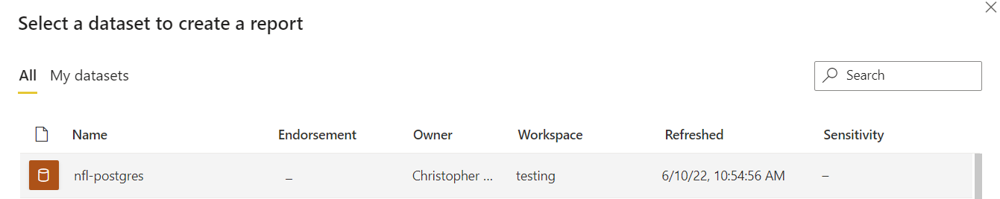

# How to commit a PowerBI PBIX to Git

## What is the problem

A PBIX file, under the hood, it just a series of text files archived into a single file.
For PowerBI to read the file and display the dashboard in PowerBI desktop or web it needs to uncompress the archive and read the files first.

Version control systems like Git are terrific at tracking text files and not designed to track files that are not text. If the file is text, then incremental changes are efficiently tracked and stored. Otherwise Git will just track versions by keeping a full history of the file.

Git will see a commit of a PBIX file and say "I can't track the changes, so I will just keep another version of the file". This results in:

1. You cannot use it to see what the changes were between versions
2. The size of the repo starts to blow out the more you commit

We want Git to track the underlying files in the archive. But we want the users to not have to worry about this.

## Git Hooks

Git hooks are scripts that Git can run before or after most Git actions (like commit, receive, checkout etc). They are kept in the hidden `.git` directory and are local client files. This means they are not tracked by Git and are not synced between remotes when pushed or pulled. There are ways to get around this.

## Sharing Git Hooks

One way to do this is to create a `hooks` director in the root of your repo and then run this configuration.

```sh
git config core.hooksPath './hooks'
```

It tells Git to look for the hooks scripts in this directory instead of the default in the `.git` directory.

## How we solve the PBIX problem

We want Git to do the following whenever a PBIX is committed:

1. Extract the PBIX into its underlying files
2. Commit these files instead
3. Do not commit the PBIX file

We want get to do the following whenever a PBIX is pulled/merged/checked out

1. Compress the PBIX

## Pre-requisite

> This will only work for PBIX that source the data from a remote source. If the DataModel is contained within the PBIX it will not work

Running on client machine with:

- Windows 10
- Git 2.27.0.windows.1
- GNU bash, version 4.4.23(1)-release (x86_64-pc-msys)
- Powershell Core 7.2.4

## Example

First let's create the PBIX.

### Dataset

I have a cloud hosted PostGres database and have loaded some sample NFL data to it subsequently loaded this to PowerBI as a XMLA dataset.


Lets open up PowerBI desktop and connect to this dataset.



### Dashboard

We will create somthing very simple

1. Text box
2. Map viz


### Use PBIT file type

We need to save this as a PBIT to ensure that one of the underlying files is created (`DataMashup`).


But then we will rename the extension back to PBIX to make things easier (i.e. double clicking the file will open it in PowerBI desktop and make it easier to edit).


### Ensure our configuration to run hooks

```sh
git config core.hooksPath './hooks'
```

### Lets commit the file and see what happens

```bash
git add nfl.pbix
git commit -m "pbix commit"
```

```log
/c/git/github/mortie23/pbix-git-version-control/hooks
nfl.pbix

Expanding pbix files...

nfl.pbix
Archive:  nfl.pbix
  inflating: ./nfl.pbix.expanded/Version
  inflating: ./nfl.pbix.expanded/[Content_Types].xml
  inflating: ./nfl.pbix.expanded/DataMashup
  inflating: ./nfl.pbix.expanded/DiagramLayout
  inflating: ./nfl.pbix.expanded/Report/Layout
  inflating: ./nfl.pbix.expanded/Settings
  inflating: ./nfl.pbix.expanded/Metadata
  inflating: ./nfl.pbix.expanded/Connections
  inflating: ./nfl.pbix.expanded/Report/StaticResources/SharedResources/BaseThemes/CY22SU03.json
  inflating: ./nfl.pbix.expanded/SecurityBindings

7-Zip 21.07 (x64) : Copyright (c) 1999-2021 Igor Pavlov : 2021-12-26

Scanning the drive for archives:
1 file, 1775 bytes (2 KiB)

Extracting archive: .\nfl.pbix.expanded\DataMashup

WARNINGS:
There are data after the end of archive

--
Path = .\nfl.pbix.expanded\DataMashup
Type = zip
WARNINGS:
There are data after the end of archive
Offset = 8
Physical Size = 792
Tail Size = 975
Characteristics = Local Central

Everything is Ok

Archives with Warnings: 1

Warnings: 1
Files: 3
Size:       499
Compressed: 1775
Unstaged changes after reset:
M       README.md
[master 8e7d696] pbix commit
 11 files changed, 6 insertions(+)
 create mode 100644 nfl.pbix.expanded/Connections
 create mode 100644 nfl.pbix.expanded/DataMashup.7zexpanded/Config/Package.xml
 create mode 100644 nfl.pbix.expanded/DataMashup.7zexpanded/Formulas/Section1.m
 create mode 100644 nfl.pbix.expanded/DataMashup.7zexpanded/[Content_Types].xml
 create mode 100644 nfl.pbix.expanded/DiagramLayout
 create mode 100644 nfl.pbix.expanded/Metadata
 create mode 100644 nfl.pbix.expanded/Report/Layout
 create mode 100644 nfl.pbix.expanded/Report/StaticResources/SharedResources/BaseThemes/CY22SU03.json
 create mode 100644 nfl.pbix.expanded/Settings
 create mode 100644 nfl.pbix.expanded/Version
 create mode 100644 nfl.pbix.expanded/[Content_Types].xml
```

### After the commit

The PBIX file itself was not committed, but instead the directory containing the files was committed.


### On checkout

So now let's delete the PBIX and then checkout and see what happens.

```bash
git checkout
```

```log
/c/git/github/mortie23/pbix-git-version-control/hooks

Creating pbix files...

nfl.pbix.expanded
Removing ./nfl.pbix
rm: cannot remove './nfl.pbix': No such file or directory

7-Zip 21.07 (x64) : Copyright (c) 1999-2021 Igor Pavlov : 2021-12-26

Scanning the drive:
2 folders, 3 files, 499 bytes (1 KiB)

Creating archive: DataMashup.7z

Add new data to archive: 2 folders, 3 files, 499 bytes (1 KiB)


Files read from disk: 3
Archive size: 535 bytes (1 KiB)
Everything is Ok

C:/git/github/mortie23/pbix-git-version-control nfl.pbix
Remove DataMashup C:/git/github/mortie23/pbix-git-version-control/nfl.pbix.expanded/DataMashup
```

The PBIX was created and successfully opens in PowerBI desktop.

### Testing a change

We will make one small change and then look at the diff that is created.

Let's just change the text in the textbox.


Save the PBIX file and then commit. See the key info from the log is that only 1 file was changed:

```log
[master e8f64a9] feat: textbox change
 1 file changed, 0 insertions(+), 0 deletions(-)
 rewrite nfl.pbix.expanded/Report/Layout (87%)
```


We still have the issue of Git thinking this file is binary when it is actually a text file with JSON.
